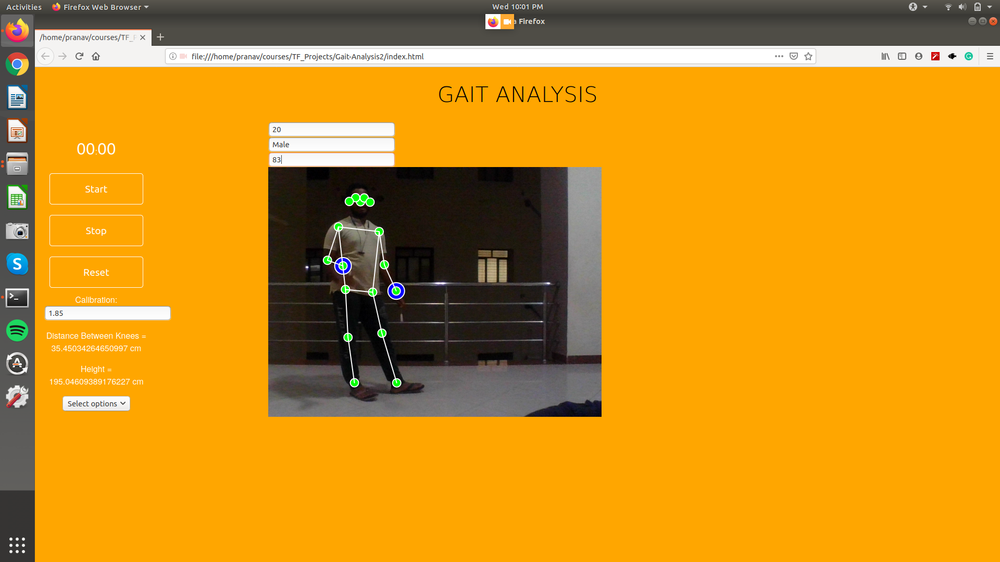
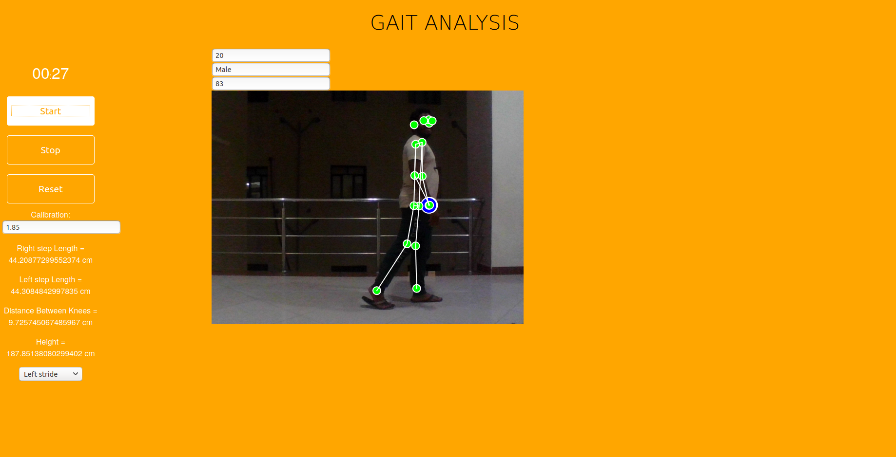
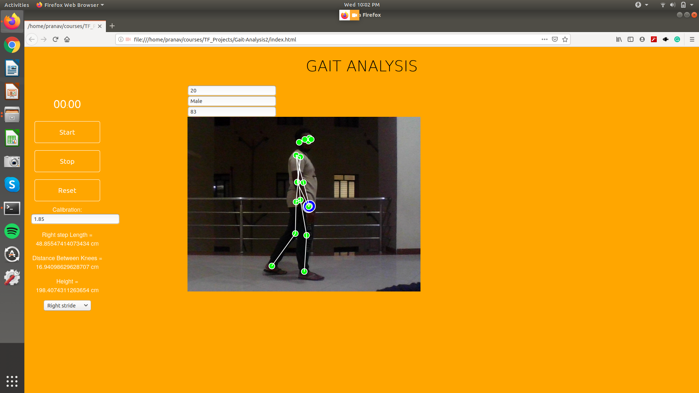
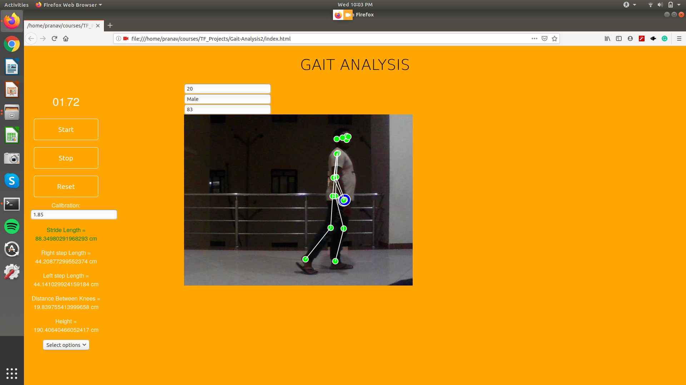

# Gait-Analysis using PoseNet

- The objective of this application is to detect anamolies with the walking style of a person.

- The most common indicators include limping, antalgic gait, Trendelenburg's sign. These are most often used to identify gait abnormalities.

Installation Prerequistes:
None, this application can run straight off a browser

How to use:

- Clone the repository.
- Open index.html in a browser of your choice.
- Enter a few details as mentioned on screen.
- Enter the calibration factor( generally around 1.85 )
- Calculate Left Stride
- Calculate Right Stride

Use Case examples:
 
 
 
 
